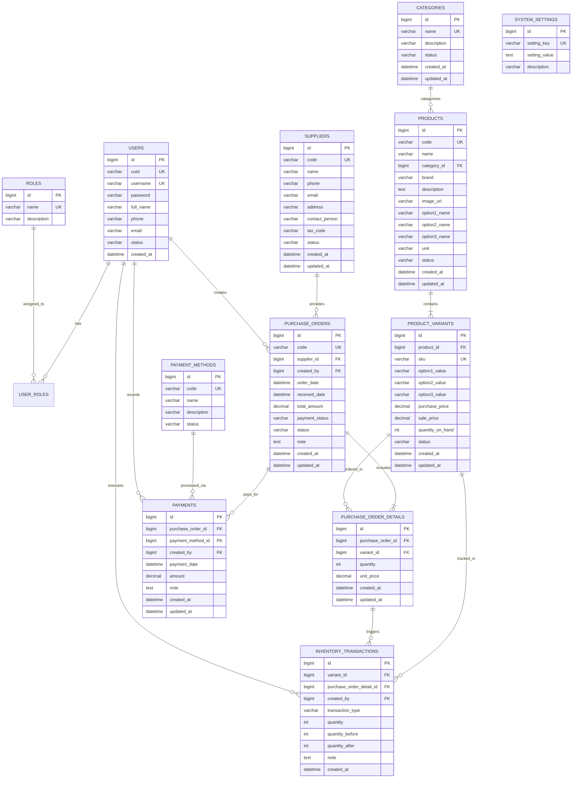
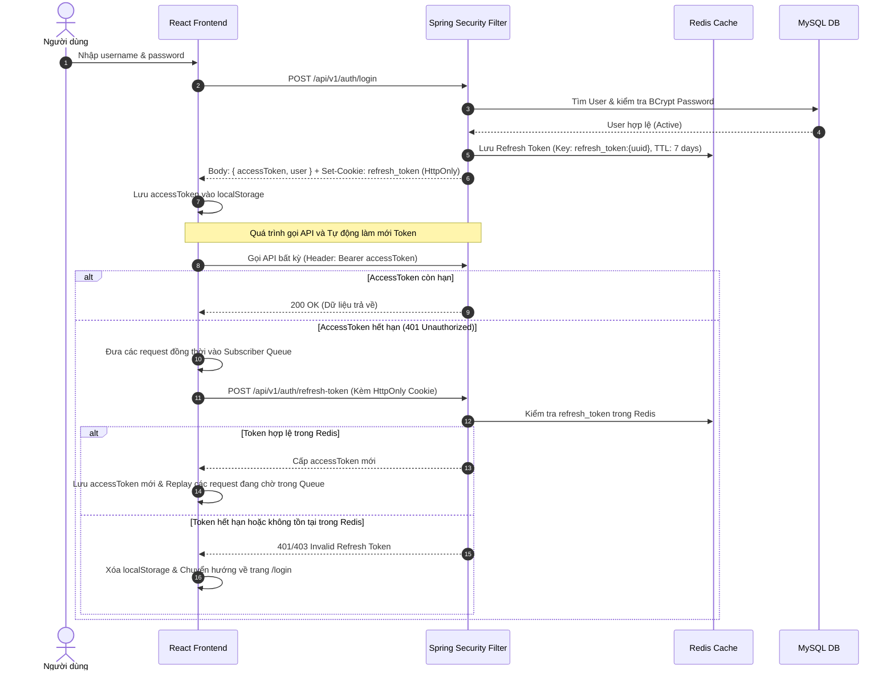
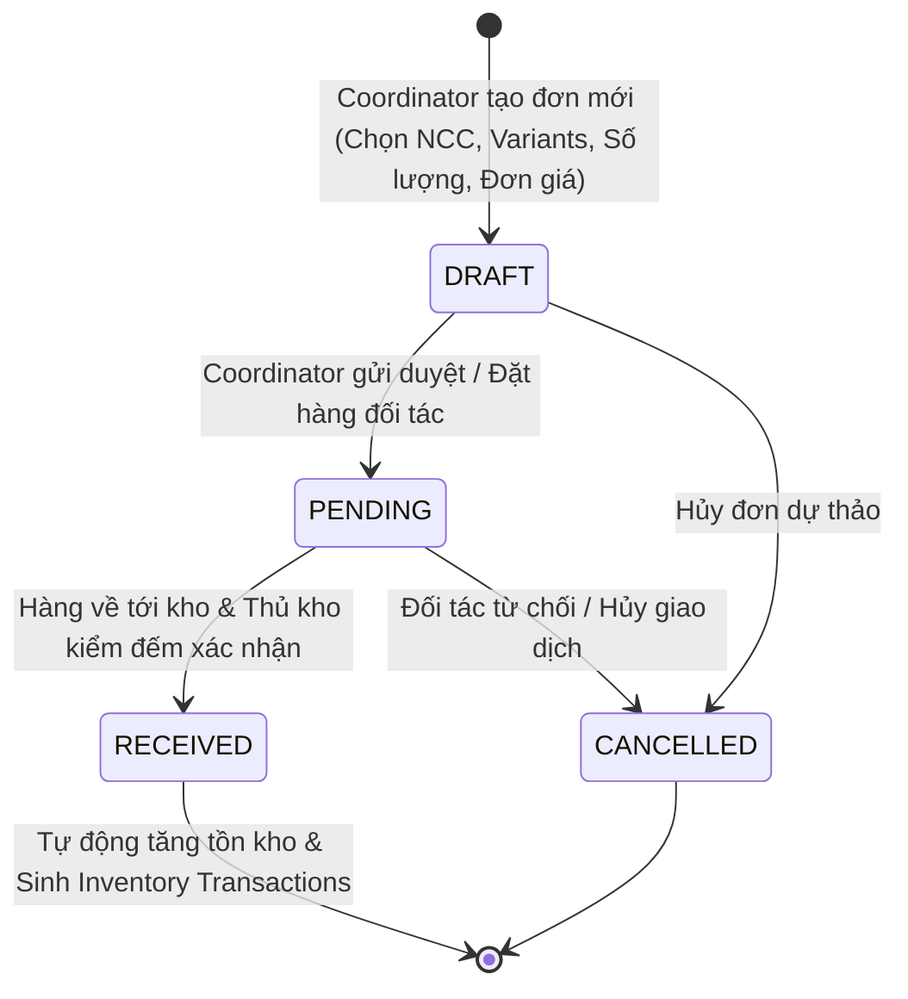

# 📦 TÀI LIỆU TOÀN DIỆN HỆ THỐNG QUẢN LÝ KHO HÀNG THỜI TRANG
## (CLOTHING INVENTORY MANAGEMENT SYSTEM - SPECIFICATION & TECHNICAL REPORT)

> **Mục đích tài liệu**: Đây là tài liệu đặc tả kiến trúc, phân tích thiết kế, quy trình nghiệp vụ và chi tiết kỹ thuật toàn diện của dự án **Clothing Inventory Management System**. Tài liệu được chuẩn hóa với đầy đủ mô hình dữ liệu (ERD), biểu đồ tuần tự (Sequence Diagram), ma trận phân quyền (RBAC Matrix), đặc tả RESTful API và tích hợp Trí tuệ nhân tạo (Generative AI), phục vụ trực tiếp cho việc biên soạn Báo cáo tốt nghiệp / Báo cáo kết thúc môn học chuyên ngành Công nghệ thông tin / Kỹ thuật phần mềm.

---

## 📑 MỤC LỤC
1. [TỔNG QUAN ĐỀ TÀI VÀ MỤC TIÊU DỰ ÁN](#1-tổng-quan-đề-tài-và-mục-tiêu-dự-án)
2. [KIẾN TRÚC HỆ THỐNG TỔNG THỂ (SYSTEM ARCHITECTURE)](#2-kiến-trúc-hệ-thống-tổng-thể-system-architecture)
3. [CÔNG NGHỆ VÀ THƯ VIỆN SỬ DỤNG (TECH STACK)](#3-công-nghệ-và-thư-viện-sử-dụng-tech-stack)
4. [PHÂN TÍCH TÁC NHÂN VÀ MA TRẬN PHÂN QUYỀN (RBAC MATRIX)](#4-phân-tích-tác-nhân-và-ma-trận-phân-quyền-rbac-matrix)
5. [THIẾT KẾ CƠ SỞ DỮ LIỆU CHI TIẾT (DATABASE DESIGN & ERD)](#5-thiết-kế-cơ-sở-dữ-liệu-chi-tiết-database-design--erd)
6. [CÁC PHÂN HỆ VÀ QUY TRÌNH NGHIỆP VỤ CỐT LÕI (CORE WORKFLOWS)](#6-các-phân-hệ-và-quy-trình-nghiệp-vụ-cốt-lõi-core-workflows)
7. [TÍCH HỢP TRÍ TUỆ NHÂN TẠO - AI KHO HÀNG (GEMINI 2.5 FLASH)](#7-tích-hợp-trí-tuệ-nhân-tạo---ai-kho-hàng-gemini-25-flash)
8. [ĐẶC TẢ RESTFUL API CHI TIẾT (API SPECIFICATION)](#8-đặc-tả-restful-api-chi-tiết-api-specification)
9. [THIẾT KẾ KIẾN TRÚC FRONTEND (SPA DESIGN)](#9-thiết-kế-kiến-trúc-frontend-spa-design)
10. [CÁC ĐIỂM SÁNG KỸ THUẬT & DESIGN PATTERNS ÁP DỤNG](#10-các-điểm-sáng-kỹ-thuật--design-patterns-áp-dụng)
11. [HƯỚNG DẪN CÀI ĐẶT VÀ VẬN HÀNH (DEPLOYMENT & SETUP)](#11-hướng-dẫn-cài-đặt-và-vận-hành-deployment--setup)
12. [KẾT QUẢ KIỂM THỬ VÀ ĐÁNH GIÁ HỆ THỐNG](#12-kết-quả-kiểm-thử-và-đánh-giá-hệ-thống)

---

## 1. TỔNG QUAN ĐỀ TÀI VÀ MỤC TIÊU DỰ ÁN

### 1.1. Bối cảnh bài toán
Trong ngành bán lẻ thời trang, việc quản lý kho hàng gặp nhiều thách thức đặc thù so với các mặt hàng tiêu chuẩn:
- **Tính đa biến thể (Multi-variant)**: Một kiểu dáng áo/quần luôn đi kèm ma trận biến thể đa chiều (Size, Màu sắc, Chất liệu). Mỗi biến thể có SKU, giá nhập, giá bán và lượng tồn kho riêng biệt.
- **Biến động nhập xuất liên tục**: Tốc độ luân chuyển hàng hóa nhanh đòi hỏi ghi nhận lịch sử tồn kho tức thời (Real-time audit log) để tránh thất thoát và sai lệch số liệu.
- **Quy trình nhập hàng nhiều bước**: Từ khi thương lượng nhà cung cấp, lên đơn đặt hàng (PO), duyệt đơn, nhận hàng vật lý, tăng tồn kho đến thanh toán công nợ nhiều đợt.
- **Nhu cầu ra quyết định thông minh**: Thủ kho và nhà quản lý cần nắm bắt trực quan tỷ lệ lấp đầy dung lượng kho, cảnh báo hàng sắp hết và khả năng tra cứu nhanh bằng ngôn ngữ tự nhiên thông qua AI.

### 1.2. Mục tiêu dự án
- Xây dựng hệ sinh thái phần mềm quản lý kho toàn diện chuẩn doanh nghiệp theo mô hình **Client-Server tách rời**.
- Triển khai cơ chế bảo mật xác thực hiện đại với **JWT Stateless kết hợp Redis Token Blacklist/Store** và **HttpOnly Cookie**.
- Hiện thực hóa mô hình quản lý sản phẩm 2 cấp độ: **Product (Master) $\rightarrow$ Product Variants (Child items)** với cơ chế tự sinh mã SKU thông minh.
- Chuẩn hóa toàn bộ chu trình cung ứng: Quản lý đối tác $\rightarrow$ Đơn đặt hàng $\rightarrow$ Nghiệm thu nhập kho $\rightarrow$ Thanh toán công nợ $\rightarrow$ Nhật ký biến động kho (`Inventory Transactions`).
- Đưa Trợ lý ảo AI (Google Gemini 2.5 Flash) vào vận hành nội bộ: Hỗ trợ kiểm tra hàng hóa, phân tích tồn kho và gợi ý hành động nghiệp vụ theo thời gian thực dựa trên phân quyền người dùng.

---

## 2. KIẾN TRÚC HỆ THỐNG TỔNG THỂ (SYSTEM ARCHITECTURE)

Hệ thống được thiết kế theo kiến trúc phân tầng (Multi-tier Layered Architecture) hướng dịch vụ, đảm bảo tính đóng gói (Encapsulation), dễ mở rộng (Scalability) và bảo trì (Maintainability).

```
                      ┌──────────────────────────────────────────────┐
                      │             CLIENT BROWSER (SPA)             │
                      │     React 19 + TypeScript + Vite + CSS Modules│
                      └──────────────────────┬───────────────────────┘
                                             │ HTTP/HTTPS (REST API)
                                             │ Bearer JWT + Cookie
                                             ▼
                      ┌──────────────────────────────────────────────┐
                      │              SPRING BOOT BACKEND             │
                      ├──────────────────────────────────────────────┤
                      │ 1. Security Filter Chain (CORS, JWT Filter)   │
                      │ 2. Controller Layer (REST Controllers)       │
                      │ 3. Service Layer (Business Logic & RBAC)     │
                      │ 4. Repository Layer (Spring Data JPA)        │
                      └──────────┬───────────────────┬───────────────┘
                                 │                   │
                     SQL Queries │                   │ Redis Commands
                                 ▼                   ▼
                      ┌──────────────────┐   ┌───────────────────────┐
                      │   MySQL SERVER   │   │     REDIS SERVER      │
                      │  (Relational DB) │   │ (Refresh Token Cache) │
                      └──────────────────┘   └───────────────────────┘
                                 ▲
                                 │ HTTP REST (Gemini API)
                      ┌──────────┴───────────────────┐
                      │    GOOGLE GEMINI 2.5 FLASH   │
                      │   (Generative AI Assistant)  │
                      └──────────────────────────────┘
```

### 2.1. Phân tầng Backend (Spring Boot 3.5)
1. **Security & Filter Tier**:
   - `CorsConfig`: Cho phép cấu hình CORS nguồn tin cậy từ frontend.
   - `JwtConfig`: Cấu hình Nimbus JWT Encoder / Decoder với thuật toán mã hóa đối xứng HMAC-SHA256.
   - `SecurityConfig`: Định nghĩa chuỗi bộ lọc bảo mật (`SecurityFilterChain`), quy định Public Endpoints vs Protected Endpoints, tích hợp Exception Handling (`AuthenticationEntryPoint`, `AccessDeniedHandler`).
2. **Controller Tier**: Nhận HTTP Request, thực hiện validate DTO đầu vào thông qua Jakarta Bean Validation (`@Valid`), điều phối xuống tầng Service và chuẩn hóa định dạng trả về dạng `FormatMessageResponseDto<T>`.
3. **Service Tier**: Xử lý logic nghiệp vụ, quản lý Transaction ACID với `@Transactional`, tích hợp MapStruct để chuyển đổi thực thể qua lại giữa Entity $\leftrightarrow$ DTO.
4. **Data Access Tier (Repository)**: Sử dụng Spring Data JPA / Hibernate tương tác với MySQL qua các truy vấn tối ưu (JPQL, Native Query, Hibernate Formula).
5. **AI Integration Tier**:
   - `GeminiApiClient`: HTTP Client giao tiếp với Google Generative Language API.
   - `ChatbotService`: Tiếp nhận truy vấn người dùng, phòng vệ Prompt Injection, thu thập ngữ cảnh nghiệp vụ theo Role (Dynamic Context Injection), gửi Gemini và bóc tách câu trả lời có cấu trúc.

### 2.2. Phân tầng Frontend (React 19 + TypeScript)
- **Routing**: `react-router-dom` v7 quản lý route phân tầng, bảo vệ route thông qua layout kiểm tra xác thực.
- **Service Layer (`services/`)**: Tách biệt hoàn toàn việc gọi API khỏi giao diện. Tích hợp `apiFetch` tự động đính kèm Bearer token và cơ chế tự làm mới Token (Auto-refresh token queue).
- **State Management**: Kết hợp React Local State, Custom Hooks (`useDebounce`, `usePagination`, `useSearch`), và React Context (`ToastContext` cho thông báo, `WarehouseContext`).
- **UI Components (`components/`)**: Thiết kế module hóa cao (Button, Modal, Drawer, Table, SearchBox, Pagination, Card, Dropdown, Chatbot Widget).
- **Styling**: Sử dụng 100% Vanilla CSS Modules (tránh xung đột style, kiểm soát kích thước bundle nhẹ và hiệu năng render cực nhanh).

---

## 3. CÔNG NGHỆ VÀ THƯ VIỆN SỬ DỤNG (TECH STACK)

### 3.1. Backend
- **Ngôn ngữ**: Java 17 (LTS) - Tận dụng Record, Sealed Classes, Text Blocks, Pattern Matching.
- **Framework nền tảng**: Spring Boot 3.5.x.
- **Framework bảo mật**: Spring Security 6.x + OAuth2 Resource Server.
- **Cơ sở dữ liệu**: MySQL 8.x (Hỗ trợ ràng buộc toàn vẹn, Transaction ACID, Fulltext index).
- **In-Memory Cache**: Redis (Lưu trữ và kiểm soát vòng đời Refresh Token theo TTL).
- **ORM / Persistence**: Spring Data JPA, Hibernate Core.
- **Code Generation & Mapping**: 
  - `Lombok`: Tự sinh Getter, Setter, Builder, AllArgsConstructor, NoArgsConstructor.
  - `MapStruct 1.6.x`: Tự sinh code mapper compile-time, tốc độ vượt trội hơn ModelMapper nhờ không dùng Reflection.
- **Trí tuệ nhân tạo (AI)**: Google Gemini API (Model: `gemini-2.5-flash`).
- **Kiểm thử**: JUnit 5, Mockito, JaCoCo (Báo cáo độ bao phủ mã kiểm thử).

### 3.2. Frontend
- **Thư viện chính**: React 19.x (Phiên bản mới nhất với cải tiến Concurrent Rendering).
- **Ngôn ngữ**: TypeScript 5.x / 6.x (Đảm bảo Type-safety, tránh Runtime TypeError).
- **Build Tool**: Vite 8.x (Khởi động dev server cực nhanh với Hot Module Replacement - HMR, build bundle tối ưu với Rollup).
- **Định tuyến (Routing)**: React Router DOM v7.x.
- **Biểu tượng (Icons)**: `@flaticon/flaticon-uicons` (Bộ icon đồ họa chuyên nghiệp, sắc nét).
- **Styling**: Vanilla CSS Modules + CSS Custom Properties (Variables).

---

## 4. PHÂN TÍCH TÁC NHÂN VÀ MA TRẬN PHÂN QUYỀN (RBAC MATRIX)

Hệ thống triển khai mô hình kiểm soát truy cập dựa trên vai trò (**Role-Based Access Control - RBAC**). Một người dùng có thể sở hữu một hoặc nhiều vai trò.

### 4.1. Danh mục các vai trò (Actors)
1. **`admin` (Quản trị viên hệ thống)**:
   - Toàn quyền quản trị tài khoản nhân sự (tạo mới, cấp quyền, khóa/mở khóa tài khoản).
   - Truy cập trang Dashboard tổng thể doanh nghiệp, số liệu doanh thu, chi phí nhập hàng.
   - Cấu hình dung lượng sức chứa tối đa của nhà kho.
2. **`coordinator` (Điều phối viên kho / Mua hàng)**:
   - Quản lý vòng đời đơn đặt hàng với đối tác cung ứng (Purchase Orders).
   - Thực hiện duyệt đơn và xác nhận nhận hàng nhập kho (Phiếu nhập kho).
   - Quản lý công nợ và thực hiện thanh toán cho nhà cung cấp.
3. **`warehouse-staff` (Nhân viên thủ kho / Kiểm kê)**:
   - Quản lý danh mục hàng hóa (Categories) và sản phẩm (Products).
   - Quản lý danh sách biến thể (Variants), thiết lập mã SKU, giá bán, giá nhập.
   - Cập nhật điều chỉnh giá hàng loạt (Bulk price update).
4. **`store-keeper` (Nhân viên phụ trách đối tác)**:
   - Quản trị danh bạ nhà cung cấp (Suppliers): Thêm mới, chỉnh sửa thông tin, vô hiệu hóa.
   - Tra cứu kênh liên hệ, hợp đồng với các đối tác cung ứng.

### 4.2. Ma trận phân quyền chi tiết (RBAC Permission Matrix)

| Chức năng / API Resource | Endpoint | `admin` | `coordinator` | `warehouse-staff` | `store-keeper` |
| :--- | :--- | :---: | :---: | :---: | :---: |
| **Đăng nhập / Đăng xuất / Refresh** | `/api/v1/auth/*` | ✅ | ✅ | ✅ | ✅ |
| **Tạo tài khoản người dùng** | `POST /api/v1/auth/register` | ✅ | ❌ | ❌ | ❌ |
| **Xem danh sách người dùng** | `GET /api/v1/users` | ✅ | ❌ | ❌ | ❌ |
| **Cập nhật thông tin & Role user**| `PATCH, PUT /api/v1/users/*` | ✅ | ❌ | ❌ | ❌ |
| **Xem Dashboard tổng quan** | `GET /api/v1/dashboard` | ✅ | ❌ | ❌ | ❌ |
| **Xem biểu đồ phân tích kho** | `GET /api/v1/dashboard/analytics` | ✅ | ✅ | ❌ | ❌ |
| **Cấu hình sức chứa kho** | `GET, PUT /api/v1/settings/*` | ✅ | ❌ | ❌ | ❌ |
| **Xem danh sách sản phẩm/biến thể**| `GET /api/v1/products/*` | ✅ | ✅ | ✅ | ✅ |
| **Thêm / Sửa / Xóa sản phẩm** | `POST, PUT, DELETE /products/*`| ❌ | ❌ | ✅ | ❌ |
| **Cập nhật giá hàng loạt** | `PUT /products/variants/bulk-update-price`| ❌ | ❌ | ✅ | ❌ |
| **Xem danh mục sản phẩm** | `GET /api/v1/categories` | ✅ | ✅ | ✅ | ✅ |
| **Tạo mới danh mục** | `POST /api/v1/categories` | ❌ | ❌ | ✅ | ❌ |
| **Xem danh sách nhà cung cấp** | `GET /api/v1/suppliers` | ✅ | ✅ | ✅ | ✅ |
| **Thêm / Sửa / Xóa NCC** | `POST, PUT, DELETE /suppliers/*`| ❌ | ❌ | ❌ | ✅ |
| **Tạo / Sửa đơn đặt hàng (PO)** | `POST, PUT /purchase-orders/*` | ❌ | ✅ | ❌ | ❌ |
| **Chuyển trạng thái đơn (Duyệt/Nhận)**| `PATCH /purchase-orders/{id}/status`| ❌ | ✅ | ❌ | ❌ |
| **Xem phiếu nhập kho (RECEIVED)** | `GET /purchase-orders/received`| ✅ | ✅ | ✅ | ❌ |
| **Thực hiện thanh toán đơn hàng** | `POST /api/v1/payments` | ❌ | ✅ | ❌ | ❌ |
| **Xem lịch sử thanh toán đơn** | `GET /payments/purchase-order/{id}`| ✅ | ✅ | ❌ | ❌ |
| **Xem nhật ký giao dịch tồn kho** | `GET /inventory-transactions` | ✅ | ✅ | ✅ | ❌ |
| **Hỏi đáp Trợ lý ảo AI (Chatbot)** | `POST /api/v1/chatbot/message` | ✅ (Full) | ✅ (PO data)| ✅ (Product) | ✅ (Supplier) |

---

## 5. THIẾT KẾ CƠ SỞ DỮ LIỆU CHI TIẾT (DATABASE DESIGN & ERD)

### 5.1. Sơ đồ thực thể liên kết (Entity Relationship Diagram - ERD)



### 5.2. Danh sách thực thể và thuộc tính chi tiết

#### 1. Bảng `users` (Tài khoản người dùng)
- `id` (BIGINT, PK, Auto Increment): Mã định danh nội bộ.
- `uuid` (VARCHAR(36), Unique, Not Null): UUID v4 dùng cho public client routing, tăng tính bảo mật.
- `username` (VARCHAR(100), Unique, Not Null): Tên đăng nhập.
- `password` (VARCHAR(255), Not Null): Mật khẩu băm chuẩn BCrypt.
- `full_name` (VARCHAR(255), Not Null): Họ và tên đầy đủ của nhân viên.
- `phone` (VARCHAR(20)): Số điện thoại liên hệ.
- `email` (VARCHAR(255)): Địa chỉ thư điện tử.
- `status` (VARCHAR(20)): Trạng thái tài khoản (`ACTIVE`, `INACTIVE`, `DELETED`).
- `created_at` (DATETIME): Thời điểm tạo tài khoản.

#### 2. Bảng `roles` & `user_roles` (Vai trò & Phân quyền)
- `roles`: `id` (PK), `name` (VARCHAR(50), UK - `admin`, `coordinator`, `warehouse-staff`, `store-keeper`), `description`.
- `user_roles`: Bảng trung gian Many-to-Many liên kết `user_id` (FK) và `role_id` (FK).

#### 3. Bảng `products` (Sản phẩm gốc / Master Product)
- `id` (BIGINT, PK, Auto Increment).
- `code` (VARCHAR(50), Unique, Not Null): Mã sản phẩm (ví dụ: `ATN-001`, `QJ-002`).
- `name` (VARCHAR(255), Not Null): Tên hiển thị của sản phẩm.
- `category_id` (BIGINT, FK $\rightarrow$ `categories.id`): Phân loại danh mục.
- `brand` (VARCHAR(100)): Thương hiệu sản xuất.
- `description` (TEXT): Mô tả chi tiết sản phẩm.
- `image_url` (VARCHAR(500)): Đường dẫn ảnh đại diện.
- `option1_name`, `option2_name`, `option3_name` (VARCHAR(100)): Tên các thuộc tính biến thể (ví dụ: "Màu sắc", "Kích thước", "Chất liệu").
- `unit` (VARCHAR(50), Not Null): Đơn vị tính (Cái, Chiếc, Bộ...).
- `status` (VARCHAR(20)): `ACTIVE`, `INACTIVE`, `DELETED`.

#### 4. Bảng `product_variants` (Biến thể chi tiết của sản phẩm)
- `id` (BIGINT, PK, Auto Increment).
- `product_id` (BIGINT, FK $\rightarrow$ `products.id`, Not Null, On Delete Cascade).
- `sku` (VARCHAR(100), Unique, Not Null): Mã lưu kho duy nhất (ví dụ: `ATN001-RED-L`).
- `option1_value`, `option2_value`, `option3_value` (VARCHAR(100)): Giá trị thuộc tính cụ thể ("Đỏ", "L", "Cotton").
- `purchase_price` (DECIMAL(15,2), Not Null): Đơn giá nhập hàng dự kiến.
- `sale_price` (DECIMAL(15,2), Not Null): Đơn giá bán niêm yết.
- `quantity_on_hand` (INT, Not Null, Default 0): Số lượng tồn kho thực tế hiện tại.
- `status` (VARCHAR(20)): Trạng thái biến thể.

#### 5. Bảng `suppliers` (Nhà cung cấp)
- `id` (BIGINT, PK, Auto Increment).
- `code` (VARCHAR(50), Unique, Not Null): Mã nhà cung cấp (ví dụ: `NCC-YAME`).
- `name` (VARCHAR(255), Not Null): Tên công ty / tổ chức cung cấp.
- `phone` (VARCHAR(20)): Hotline liên lạc.
- `email` (VARCHAR(255)): Email liên hệ.
- `address` (VARCHAR(500)): Địa chỉ trụ sở / kho hàng đối tác.
- `contact_person` (VARCHAR(100)): Tên người đại diện làm việc.
- `tax_code` (VARCHAR(50)): Mã số thuế doanh nghiệp.
- `status` (VARCHAR(20)): `ACTIVE`, `INACTIVE`.

#### 6. Bảng `purchase_orders` (Đơn đặt hàng nhà cung cấp)
- `id` (BIGINT, PK, Auto Increment).
- `code` (VARCHAR(50), Unique, Not Null): Mã phiếu đặt hàng (ví dụ: `PO-202609-001`).
- `supplier_id` (BIGINT, FK $\rightarrow$ `suppliers.id`, Not Null).
- `created_by` (BIGINT, FK $\rightarrow$ `users.id`, Not Null): Nhân viên điều phối lập đơn.
- `order_date` (DATETIME, Not Null): Ngày lập đơn.
- `received_date` (DATETIME): Ngày thực tế nhận hàng về kho.
- `total_amount` (DECIMAL(15,2)): Tổng giá trị đơn hàng bằng tiền (VNĐ).
- `payment_status` (VARCHAR(20)): Trạng thái công nợ (`UNPAID`, `PARTIAL`, `PAID`).
- `status` (VARCHAR(20)): Trạng thái vòng đời đơn (`DRAFT`, `PENDING`, `RECEIVED`, `CANCELLED`).
- `note` (TEXT): Ghi chú giao nhận / thỏa thuận.

#### 7. Bảng `purchase_order_details` (Chi tiết mặt hàng trong đơn PO)
- `id` (BIGINT, PK, Auto Increment).
- `purchase_order_id` (BIGINT, FK $\rightarrow$ `purchase_orders.id`, Not Null).
- `variant_id` (BIGINT, FK $\rightarrow$ `product_variants.id`, Not Null).
- `quantity` (INT, Not Null): Số lượng đặt mua.
- `unit_price` (DECIMAL(15,2), Not Null): Đơn giá nhập thỏa thuận tại thời điểm đặt.

#### 8. Bảng `payments` (Lịch sử thanh toán đơn hàng)
- `id` (BIGINT, PK, Auto Increment).
- `purchase_order_id` (BIGINT, FK $\rightarrow$ `purchase_orders.id`, Not Null).
- `payment_method_id` (BIGINT, FK $\rightarrow$ `payment_methods.id`, Not Null).
- `created_by` (BIGINT, FK $\rightarrow$ `users.id`, Not Null): Nhân viên ghi nhận phiếu chi.
- `payment_date` (DATETIME, Not Null): Ngày giờ giao dịch thanh toán.
- `amount` (DECIMAL(15,2), Not Null): Số tiền thanh toán trong đợt này.
- `note` (TEXT): Số hóa đơn, mã chuẩn chi ngân hàng hoặc ghi chú.

#### 9. Bảng `inventory_transactions` (Nhật ký giao dịch tồn kho)
- `id` (BIGINT, PK, Auto Increment).
- `variant_id` (BIGINT, FK $\rightarrow$ `product_variants.id`, Not Null).
- `purchase_order_detail_id` (BIGINT, FK $\rightarrow$ `purchase_order_details.id`, Nullable): Liên kết tới dòng PO kích hoạt giao dịch này.
- `created_by` (BIGINT, FK $\rightarrow$ `users.id`, Not Null): Thủ kho thực hiện thao tác.
- `transaction_type` (VARCHAR(20), Not Null): Loại giao dịch (`IMPORT` - Nhập hàng, `EXPORT` - Xuất hàng, `ADJUSTMENT` - Kiểm kê điều chỉnh).
- `quantity` (INT, Not Null): Số lượng chênh lệch thay đổi (+ hoặc -).
- `quantity_before` (INT, Not Null): Số tồn kho trước khi phát sinh biến động.
- `quantity_after` (INT, Not Null): Số tồn kho sau khi phát sinh biến động.
- `created_at` (DATETIME): Mốc thời gian hệ thống ghi nhận.

#### 10. Bảng `system_settings` (Cấu hình hệ thống & Dung lượng kho)
- `id` (BIGINT, PK, Auto Increment).
- `setting_key` (VARCHAR(100), Unique, Not Null): Khóa cấu hình (ví dụ: `WAREHOUSE_TOTAL_CAPACITY`).
- `setting_value` (TEXT, Not Null): Giá trị cấu hình (ví dụ: `50000`).
- `description` (VARCHAR(255)): Ý nghĩa của tham số.
- `updated_by` (VARCHAR(100)): Tài khoản thực hiện thay đổi cuối.

---

## 6. CÁC PHÂN HỆ VÀ QUY TRÌNH NGHIỆP VỤ CỐT LÕI (CORE WORKFLOWS)

### 6.1. Quy trình Xác thực & Phiên làm việc (Authentication & Silent Refresh Flow)

Hệ thống kết hợp Access Token ngắn hạn và Refresh Token dài hạn lưu trong Redis để vừa đạt được hiệu năng cao (Stateless verification) vừa duy trì khả năng thu hồi phiên (Token Invalidation).



### 6.2. Quy trình Quản lý Mua hàng - Nhập kho - Tồn kho (Procurement & Inventory Inwarding)

Vòng đời đơn đặt hàng trải qua 4 trạng thái tuần tự được kiểm soát chặt chẽ bằng State Machine logic:



#### Chi tiết bước xác nhận nhập kho (`PATCH /api/v1/purchase-orders/{id}/status` với status = `RECEIVED`):
1. **Kiểm tra trạng thái**: Đơn hàng bắt buộc phải đang ở trạng thái `PENDING`.
2. **Kích hoạt Giao dịch ACID (`@Transactional`)**:
   - Cập nhật `purchase_orders.status = RECEIVED` và gắn thời gian `received_date = LocalDateTime.now()`.
   - Lặp qua danh sách `purchase_order_details`:
     - Truy vấn `ProductVariant` tương ứng với khóa bi quan hoặc khóa phiên bản.
     - Lấy `quantityBefore = variant.getQuantityOnHand()`.
     - Tính toán `quantityAfter = quantityBefore + detail.getQuantity()`.
     - Cập nhật `variant.setQuantityOnHand(quantityAfter)`.
     - Khởi tạo thực thể `InventoryTransaction` ghi rõ: `transactionType = "IMPORT"`, `quantity = detail.getQuantity()`, `quantityBefore`, `quantityAfter`, `purchaseOrderDetail = detail`.
     - Lưu giao dịch vào cơ sở dữ liệu.
3. Nếu xảy ra bất kỳ lỗi runtime nào, toàn bộ quá trình rollback hoàn toàn, đảm bảo số liệu kho không bị sai lệch.

### 6.3. Quy trình Thanh toán Đơn hàng & Quản lý Công nợ

Đơn đặt hàng cho phép thanh toán nhiều đợt. Sau mỗi đợt chi trả:
- Tính tổng tiền đã thanh toán từ bảng `payments` theo `purchase_order_id`.
- So sánh với `total_amount` của đơn hàng:
  - Nếu $\sum Payment = 0$: `paymentStatus = UNPAID`.
  - Nếu $0 < \sum Payment < totalAmount$: `paymentStatus = PARTIAL` (Thanh toán một phần).
  - Nếu $\sum Payment \ge totalAmount$: `paymentStatus = PAID` (Đã thanh toán đủ).

---

## 7. TÍCH HỢP TRÍ TUỆ NHÂN TẠO - AI KHO HÀNG (GEMINI 2.5 FLASH)

Hệ thống tích hợp Trợ lý AI thế hệ mới được nhúng trực tiếp trong giao diện ứng dụng nhằm tối ưu hóa năng suất vận hành.

### 7.1. Kiến trúc phân tích & Phân đoạn ngữ cảnh (Context Partitioning by RBAC)
Để bảo vệ an toàn dữ liệu và tuân thủ nguyên tắc Least Privilege, module AI không đưa toàn bộ cơ sở dữ liệu cho mô hình mà sử dụng cơ chế **Dynamic Context Injection** dựa trên vai trò của người dùng hiện tại:

```
[User Message] ──► [ChatbotSecurityValidator] ──► [Resolve User Role] ──► [Build Safe Context]
                         (Chống Injection)             (SecurityContext)           │
                                                                                   ├─ ADMIN: Toàn bộ kho, PO, User, NCC
                                                                                   ├─ COORDINATOR: Đơn hàng, Biến động tháng
                                                                                   ├─ STORE_KEEPER: Nhà cung cấp, Liên hệ
                                                                                   └─ WAREHOUSE_STAFF: Tồn kho, Danh mục
                                                                                           │
                                                                                           ▼
[Parse structured reply & tags] ◄── [Gemini 2.5 Flash] ◄── [System Prompt + Context + History]
```

### 7.2. Phòng vệ An ninh (Prompt Injection Defense)
`ChatbotSecurityValidator` thực hiện rà soát nghiêm ngặt đầu vào:
- Phát hiện các mẫu câu độc hại: `"ignore previous instructions"`, `"system override"`, `"drop database"`, `"show passwords"`.
- Làm sạch các ký tự điều khiển lạ, cô lập câu hỏi của người dùng vào thẻ cấu trúc `<user_input>...</user_input>`.

### 7.3. Định dạng phản hồi có cấu trúc (Structured Output Parsing)
Mô hình Gemini được chỉ dẫn trả về câu trả lời chuẩn Markdown kết hợp các thẻ cấu trúc nội bộ:
- Thẻ liên kết sản phẩm: `[Tên sản phẩm](/products/{id})` $\rightarrow$ Frontend tự động nhận diện và hiển thị thành chip điều hướng bấm được sang trang chi tiết.
- Thẻ gợi ý hành động: `<suggestions>["Câu hỏi gợi ý 1", "Câu hỏi gợi ý 2"]</suggestions>` $\rightarrow$ Frontend render thành danh sách Quick-Action Buttons giúp người dùng bấm hỏi tiếp mà không cần gõ phím.

---

## 8. ĐẶC TẢ RESTFUL API CHI TIẾT (API SPECIFICATION)

> Toàn bộ API đều có tiền tố chuẩn: `/api/v1`. Các protected API yêu cầu Header: `Authorization: Bearer <accessToken>`.

### 8.1. Phân hệ Xác thực (`/api/v1/auth`)

| Method | Endpoint | Quyền hạn | Request Body tóm tắt | Response thành công (200/201) |
| :--- | :--- | :--- | :--- | :--- |
| `POST` | `/login` | Public | `{ username, password }` | `{ accessToken, uuid, fullName, email, roles }` + Set-Cookie `refresh_token` |
| `POST` | `/refresh-token` | Public (Cookie) | *(Rỗng - Đọc từ HttpOnly Cookie)* | `{ accessToken }` |
| `POST` | `/logout` | Authenticated | *(Rỗng)* | Thu hồi refresh token trong Redis, xóa Cookie |
| `GET` | `/me` | Authenticated | *(None)* | `{ uuid, username, fullName, email, phone, roles }` |
| `POST` | `/register` | `admin` | `{ username, password, fullName, email, phone, roleNames }` | Tạo tài khoản người dùng mới |

### 8.2. Phân hệ Quản trị Người dùng (`/api/v1/users`)

| Method | Endpoint | Quyền hạn | Mô tả |
| :--- | :--- | :--- | :--- |
| `GET` | `/` | `admin` | Danh sách người dùng (Phân trang: `page`, `size`, tìm kiếm: `keyword`) |
| `PATCH`| `/{uuid}` | `admin` | Cập nhật thông tin cơ bản: `{ fullName, phone, email, status }` |
| `PUT` | `/{uuid}/roles` | `admin` | Phân quyền lại: `{ roles: ["coordinator", "store-keeper"] }` |

### 8.3. Phân hệ Sản phẩm & Biến thể (`/api/v1/products`)

| Method | Endpoint | Quyền hạn | Request Body / Params | Mô tả |
| :--- | :--- | :--- | :--- | :--- |
| `GET` | `/` | Authenticated | Query: `page, size, keyword, categoryId, status` | Lấy danh sách sản phẩm phân trang |
| `GET` | `/variants` | Authenticated | Query: `keyword, productId, inStock` | Lấy danh sách biến thể tồn kho |
| `POST` | `/` | `warehouse-staff` | DTO: `name, categoryId, brand, unit, option1Name, option2Name, variants: [...]` | Tạo sản phẩm kèm danh sách biến thể |
| `PUT` | `/{id}` | `warehouse-staff` | DTO cập nhật thông tin sản phẩm và các biến thể | Cập nhật toàn bộ sản phẩm |
| `PUT` | `/variants/{id}`| `warehouse-staff` | `{ purchasePrice, salePrice, status }` | Cập nhật đơn giá 1 biến thể |
| `PUT` | `/variants/bulk-update-price` | `warehouse-staff` | `{ items: [{ variantId, purchasePrice, salePrice }] }` | Cập nhật giá đồng loạt |
| `DELETE`| `/{id}` | `warehouse-staff` | *(None)* | Đổi trạng thái sản phẩm sang DELETED |
| `DELETE`| `/variants` | `warehouse-staff` | `{ variantIds: [1, 2, 3] }` | Vô hiệu hóa hàng loạt biến thể |

### 8.4. Phân hệ Nhà cung cấp (`/api/v1/suppliers`)

| Method | Endpoint | Quyền hạn | Mô tả |
| :--- | :--- | :--- | :--- |
| `GET` | `/` | Authenticated | Tìm kiếm & phân trang danh sách nhà cung cấp |
| `POST` | `/` | `store-keeper` | Thêm mới nhà cung cấp: `{ code, name, phone, email, address, taxCode }` |
| `PUT` | `/{code}` | `store-keeper` | Cập nhật thông tin toàn phần theo mã đối tác |
| `DELETE`| `/{code}` | `store-keeper` | Đổi trạng thái nhà cung cấp sang INACTIVE |

### 8.5. Phân hệ Đơn đặt hàng (`/api/v1/purchase-orders`)

| Method | Endpoint | Quyền hạn | Mô tả & Dữ liệu gửi lên |
| :--- | :--- | :--- | :--- |
| `GET` | `/` | Authenticated | Danh sách đơn đặt hàng (Filter: `keyword, status, fromDate, toDate`) |
| `GET` | `/received` | Authenticated | Danh sách phiếu nhập kho (chỉ các đơn `status = RECEIVED`) |
| `GET` | `/{id}` | Authenticated | Chi tiết đơn đặt hàng bao gồm danh sách mặt hàng và lịch sử thanh toán |
| `POST` | `/` | `coordinator` | Lập đơn mới: `{ supplierId, orderDate, note, details: [{ variantId, quantity, unitPrice }] }` |
| `PUT` | `/{id}` | `coordinator` | Sửa đơn hàng (Chỉ cho phép khi đơn đang ở trạng thái `DRAFT`) |
| `PATCH`| `/{id}/status`| `coordinator` | Chuyển đổi trạng thái đơn: `{ status: "PENDING" \| "RECEIVED" \| "CANCELLED" }` |

### 8.6. Phân hệ Thanh toán (`/api/v1/payments`)

| Method | Endpoint | Quyền hạn | Mô tả |
| :--- | :--- | :--- | :--- |
| `POST` | `/` | `coordinator` | Ghi nhận thanh toán: `{ purchaseOrderId, paymentMethodId, amount, note }` |
| `GET` | `/purchase-order/{id}` | `admin`, `coordinator` | Lấy toàn bộ lịch sử các đợt thanh toán của đơn hàng |

### 8.7. Phân hệ Thống kê Dashboard & Thiết lập Kho

| Method | Endpoint | Quyền hạn | Mô tả |
| :--- | :--- | :--- | :--- |
| `GET` | `/api/v1/dashboard` | `admin` | Số liệu thống kê tổng: Doanh số, chi phí nhập, tổng SKU, hàng hết tồn |
| `GET` | `/api/v1/dashboard/analytics` | `admin`, `coordinator` | Dữ liệu biểu đồ biến động kho theo chu kỳ (`3months`, `6months`, `year`) |
| `GET` | `/api/v1/settings/warehouse-capacity` | Authenticated | Xem tỷ lệ lấp đầy kho: `{ totalCapacity, currentOccupied, occupancyRate }` |
| `PUT` | `/api/v1/settings/warehouse-capacity` | `admin` | Cập nhật sức chứa tối đa của kho: `{ totalCapacity: 100000 }` |

### 8.8. Phân hệ Trợ lý AI (`/api/v1/chatbot`)

| Method | Endpoint | Quyền hạn | Mô tả |
| :--- | :--- | :--- | :--- |
| `POST` | `/message` | Authenticated | Gửi tin nhắn hỏi đáp kho hàng: `{ message, history: [...] }` |
| `GET` | `/models` | Authenticated | Danh sách các mô hình AI khả dụng |

---

## 9. THIẾT KẾ KIẾN TRÚC FRONTEND (SPA DESIGN)

### 9.1. Cấu trúc tổ chức thư mục Frontend
```
frontend/src/
├── components/                  # Thư viện UI components tái sử dụng
│   ├── Button/ Card/ Drawer/ Input/ Modal/ Pagination/ SearchBox/ Select/ Table/ Toast/
│   ├── Chatbot/                 # Cửa sổ Trợ lý ảo AI góc màn hình
│   ├── WarehouseCapacityWidget/ # Widget hiển thị dung lượng & đồng hồ tiến độ kho
│   ├── SupplierDetailModal/     # Modal xem chi tiết nhà cung cấp
│   ├── UserDetailModal/         # Modal quản lý vai trò người dùng
│   └── VariantDetailModal/      # Modal quản lý biến thể sản phẩm
│
├── layouts/
│   └── DashboardLayout/         # Bố cục chuẩn: Header, Sidebar responsive, Drawer di động
│
├── pages/                       # Màn hình chức năng phân theo vai trò người dùng
│   ├── Login/                   # Màn hình đăng nhập
│   ├── Dashboard/               # Bảng điều khiển phân tích & biểu đồ trực quan
│   ├── Profile/                 # Thông tin tài khoản cá nhân
│   ├── Admin/UserManagement/    # Quản lý danh sách & phân quyền nhân viên
│   ├── Coordinator/
│   │   ├── PurchaseOrder/       # Lập và theo dõi đơn mua hàng
│   │   ├── WarehouseReceipt/    # Quản lý phiếu nhập kho
│   │   └── Payment/             # Quản lý thanh toán công nợ
│   ├── StoreKeeper/
│   │   ├── SupplierManagement/  # Quản trị danh mục nhà cung cấp
│   │   └── SupplierContact/     # Danh bạ liên hệ đối tác
│   └── WarehouseStaff/
│       ├── ProductList/         # Tra cứu & quản lý sản phẩm
│       └── CreateProduct/       # Form tạo sản phẩm ma trận biến thể
│
├── services/                    # Tầng giao tiếp HTTP Backend (Tách biệt UI)
│   ├── api.ts                   # Fetch wrapper (Đính kèm Bearer token, auto refresh queue)
│   ├── auth.ts / product.ts / supplier.ts / purchaseOrder.ts / payment.ts / chatbot.ts ...
│
├── context/                     # Quản lý trạng thái toàn cục
│   ├── ToastContext.tsx         # Hệ thống thông báo nổi (Success, Error, Warning)
│   └── WarehouseContext.tsx     # Context dữ liệu kho
│
└── utils/                       # Hàm tiện ích chung (Format tiền tệ VNĐ, ngày tháng, validate)
```

### 9.2. Kỹ thuật xử lý Token Refresh trên Client (`services/api.ts`)
Khi nhiều thành phần giao diện cùng gửi request lên backend và Access Token vừa hết hạn, nếu không có cơ chế điều phối sẽ dẫn đến tình trạng "bão request refresh" (Race condition). Frontend hiện thực hóa **Subscriber Queue Pattern**:
1. Đặt cờ hiệu toàn cục `isRefreshing = false` và hàng đợi `refreshSubscribers = []`.
2. Khi gặp lỗi HTTP 401:
   - Nếu `isRefreshing === false`: Đổi thành `true`, gọi duy nhất 1 lần `POST /auth/refresh-token`.
   - Các request 401 khác phát sinh trong lúc này được gói thành callback và đẩy vào `refreshSubscribers`.
3. Khi nhận được token mới: Lưu vào `localStorage`, duyệt qua `refreshSubscribers` để thực thi lại toàn bộ các request ban đầu với token mới, sau đó giải phóng cờ `isRefreshing = false`.
4. Nếu refresh thất bại: Lập tức dọn sạch bộ nhớ và điều hướng người dùng về trang Đăng nhập.

---

## 10. CÁC ĐIỂM SÁNG KỸ THUẬT & DESIGN PATTERNS ÁP DỤNG

1. **Layered Architecture & Separation of Concerns (SoC)**:
   - Tách bạch rõ rệt giữa Controller, Service, Repository, DTO và Model.
   - Không để lộ trực tiếp JPA Entity ra ngoài REST Controller thông qua việc bắt buộc sử dụng DTO.
2. **Compile-time Object Mapping với MapStruct**:
   - Thay thế Reflection-based mapping (ModelMapper/BeanUtils) bằng MapStruct code generator giúp tăng tốc độ ánh xạ đối tượng gấp hàng chục lần và phát hiện lỗi sai lệch trường ngay khi biên dịch (`mvn compile`).
3. **Data Integrity & Concurrency Control**:
   - Sử dụng `@Transactional` tại tầng Service cho các nghiệp vụ quan trọng như duyệt đơn `RECEIVED` để đảm bảo tính toàn vẹn dữ liệu: tăng tồn kho và ghi lịch sử giao dịch phải cùng thành công hoặc cùng rollback.
4. **Bảo mật nhiều lớp (Defense in Depth)**:
   - Mật khẩu băm chuẩn BCrypt với Salt ngẫu nhiên.
   - Access Token lưu ở client-side ngắn hạn; Refresh Token lưu trong **HttpOnly Cookie** chống hoàn toàn nguy cơ tấn công đánh cắp phiên qua mã độc XSS.
   - Server-side token invalidation tức thì thông qua Redis blacklist.
   - Kiểm soát quyền hạn kép: URL-based authorization tại Spring Security Filter kết hợp Method-level security (`@PreAuthorize("hasAuthority('...')")`).
   - Phòng chống Prompt Injection tại tầng ứng dụng AI.
5. **Tối ưu hóa UI/UX**:
   - Debounce search input: Giảm thiểu 90% số lượng request tìm kiếm không cần thiết lên máy chủ khi người dùng gõ phím.
   - Responsive Design: Thích ứng mượt mà trên Desktop, Tablet và Mobile nhờ thanh điều hướng linh hoạt (Sidebar + Drawer).

---

## 11. HƯỚNG DẪN CÀI ĐẶT VÀ VẬN HÀNH (DEPLOYMENT & SETUP)

### 11.1. Yêu cầu môi trường tiền đề
- **Java Development Kit (JDK)**: Phiên bản 17 trở lên.
- **Node.js**: Phiên bản 18.x hoặc 20.x trở lên & **npm**.
- **MySQL Server**: Phiên bản 8.0 trở lên (Port mặc định: 3306).
- **Redis Server**: Phiên bản 6.x trở lên (Port mặc định: 6379).

### 11.2. Cấu hình Biến môi trường Backend
Tạo file `.env` hoặc cấu hình Environment Variables trong IDE cho Backend:

```env
# Cấu hình Cơ sở dữ liệu MySQL
MYSQL_URL=jdbc:mysql://localhost:3306/clothing_inventory?useSSL=false&serverTimezone=UTC&allowPublicKeyRetrieval=true
MYSQL_USERNAME=root
MYSQL_PASSWORD=your_mysql_password

# Cấu hình JWT Token (Secret Key tối thiểu 256 bits)
SECRET_KEY=9a4f2c8d7e1b5a3f6c8e0d2b4a6c8e1f3a5b7c9d1e3f5a7b9c1d3e5f7a9b1c3e
ACCESS_TOKEN_VALIDITY_IN_SECONDS=1800
REFRESH_TOKEN_VALIDITY_IN_SECONDS=604800

# Cấu hình Redis Cache
REDIS_HOST=localhost
REDIS_PORT=6379

# Cấu hình Trí tuệ nhân tạo Google Gemini
GEMINI_API_KEY=your_google_gemini_api_key
GEMINI_API_MODEL=gemini-2.5-flash
GEMINI_API_BASE_URL=https://generativelanguage.googleapis.com/v1beta
GEMINI_API_TIMEOUT_SECONDS=25
```

### 11.3. Cấu hình Frontend
Tạo file `frontend/.env`:
```env
VITE_API_URL=http://localhost:8080/api/v1
```

### 11.4. Các bước khởi chạy dự án

#### Bước 1: Khởi động Backend
```bash
cd backend

# Biên dịch kiểm tra mã nguồn
./mvnw clean compile

# Khởi động ứng dụng Spring Boot
./mvnw spring-boot:run
# (Hoặc trên Windows Command Prompt: mvnw.cmd spring-boot:run)

# Máy chủ API sẽ lắng nghe tại: http://localhost:8080
```

#### Bước 2: Khởi động Frontend
```bash
cd frontend

# Cài đặt toàn bộ dependencies
npm install

# Khởi chạy máy chủ phát triển Vite
npm run dev

# Ứng dụng web sẵn sàng tại: http://localhost:5173
```

---

## 12. KẾT QUẢ KIỂM THỬ VÀ ĐÁNH GIÁ HỆ THỐNG

Dự án đi kèm bộ kịch bản kiểm thử toàn diện được tài liệu hóa chi tiết tại file [`TESTCASES.md`](./TESTCASES.md) với hơn **1.600 dòng đặc tả**, bao gồm 10 danh mục kiểm thử:

1. **Kiểm thử Xác thực (Authentication Tests - TC-AUTH)**: Kiểm tra đăng nhập đúng/sai mật khẩu, tài khoản vô hiệu hóa, tự động cấp lại token và hủy phiên làm việc.
2. **Kiểm thử Phân quyền (Authorization Tests - TC-SEC)**: Xác minh ngăn chặn truy cập trái phép khi một role cố tình gọi API của role khác (403 Forbidden).
3. **Kiểm thử Quản lý Sản phẩm (Product Tests - TC-PROD)**: Kiểm tra tính duy nhất của mã SKU, tạo sản phẩm kèm ma trận biến thể, cập nhật giá hàng loạt và xóa an toàn.
4. **Kiểm thử Chu trình Nhập kho (Procurement Tests - TC-PO)**: Kiểm tra chuyển đổi trạng thái đơn hàng (`DRAFT` $\rightarrow$ `PENDING` $\rightarrow$ `RECEIVED`), xác minh tồn kho tăng chính xác và giao dịch tồn kho được tạo tự động.
5. **Kiểm thử Quản lý Công nợ (Payment Tests - TC-PAY)**: Xác minh luồng thanh toán nhiều đợt, tính toán chính xác trạng thái `PARTIAL` và `PAID`.
6. **Kiểm thử Trợ lý AI (Chatbot Tests - TC-AI)**: Đánh giá khả năng phòng chống Prompt Injection, kiểm tra tính chính xác của dữ liệu phản hồi theo phân quyền người hỏi.
7. **Kiểm thử Giao diện Người dùng (UI/UX Tests)**: Kiểm tra luồng điều hướng, tính tương thích trên các kích thước màn hình và độ ổn định của hệ thống thông báo Toast.

---

> **Bản quyền dự án**: © 2026 - Clothing Inventory Management System. Toàn quyền bảo lưu mã nguồn và tài liệu kỹ thuật.
